<div name = "demo" align="center" width=800>
  
</div>

# FIFA X

## 📝 Table of Contents

- [About](#about)
- [Live](#live)
- [features](#features)
- [Technologies used](#build)
- [getting started](#start)
- [Demo](#demo)
- [screenshots](#screenshots)

## 🚩About<a name = "about"></a>

This is an online automated ticket reservation system for football matches in FIFA World Cup Qatar 2022.

The system allows a manager to create, manage, and maintain current and future matches.

The system also allows the customers to reserve specific seats for the matches they want to attend.

The system is used by specific managers to keep track of matches
schedules, number of attendees, match officials and the registered users

##  🔥Live <a name = "live"></a>

Watch Live [here](https://fifa-world-cup.surge.sh/)

## ✨ Features <a name = "features"></a>

**for user**

- Sign up either as a Fan or manager then admin will approve your account
- edit user information
- Show All matches events
- View vacant/reserved seats for each match.
- Reserve a seat for a match & paymanet integration with paypal
- show all user reservations
- cancel reservation **with paypal refund**
- show stadiums information

**for manager**

- Create a match Event `(only manager)`
- edit any matche events `(only manager)`
- add new stadium `(only manager)`

**for Admin**

- show all users with their roles
- assign role as manager to any user
- delete user

## 💻Technologies Used<a name = "build"></a>

- React
- React-Router dom
- Redux Toolkit
- Axios
- react-paypal
- react-bootstrap
- react-toastify

## 🏁Getting Started <a name = "start"></a>

1. **_Clone the repository_**

```bash
git clone https://github.com/omar214/FIFA-X.git

```

2. **_Go to the directory of the repository_**

```bash
cd FIFA-X

```

3. **_to run frontend_**

```bash
yarn

yarn start

```

## 🎥 Demo<a name = "demo"></a>

<div name = "demo" align="center" width=1189>


https://user-images.githubusercontent.com/60351557/210155419-7e9e9d08-7be7-4744-94ba-af97c3b2bfcb.mp4


</div>

## 🎥 screenshots<a name = "screenshots"></a>

### Home Page

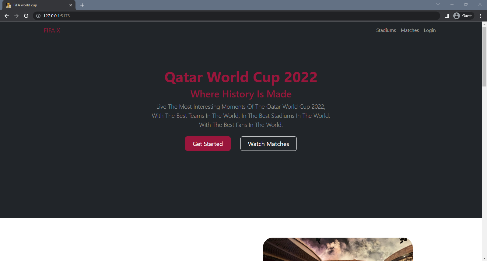
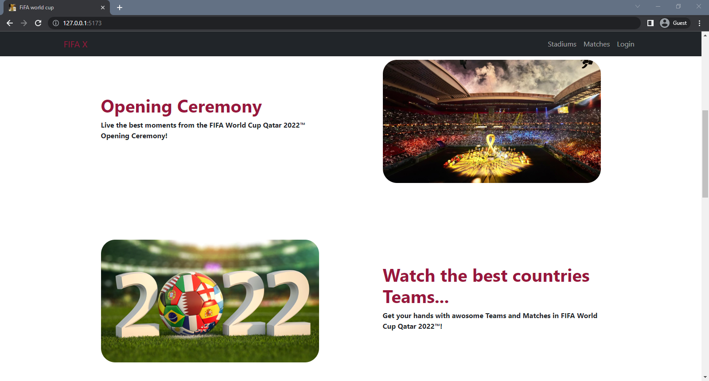
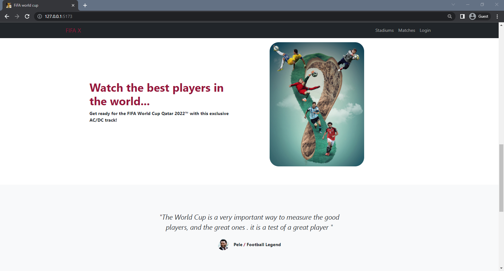
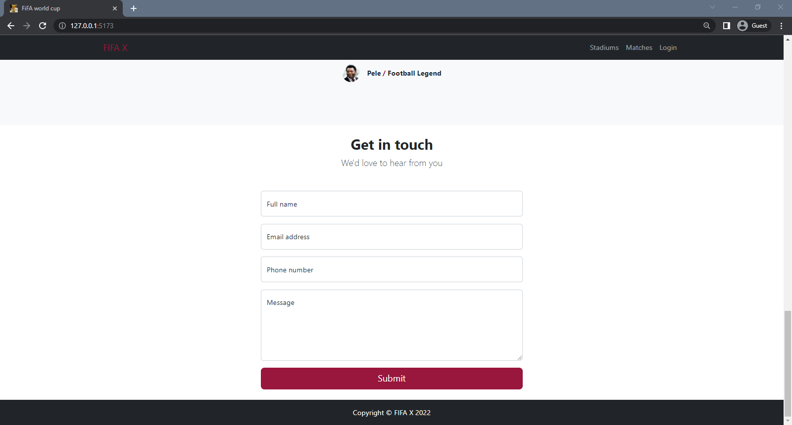

  <hr />

### Log in

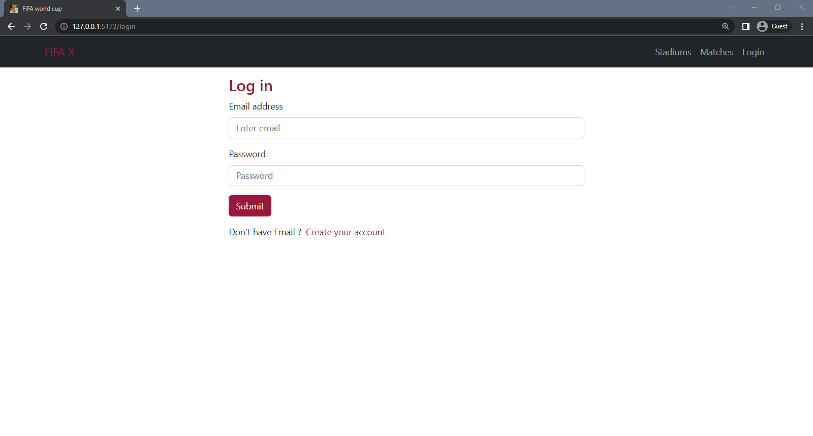

  <hr />

### Sign up

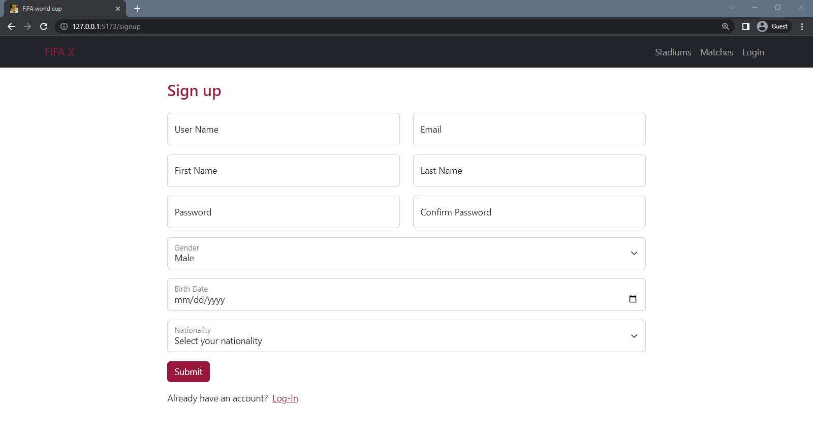

  <hr />

### Matches Page

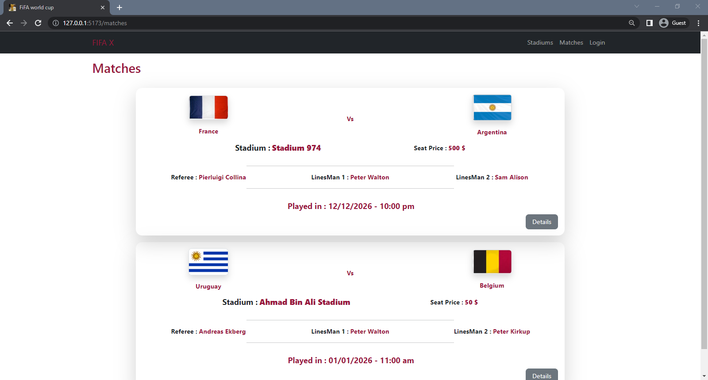
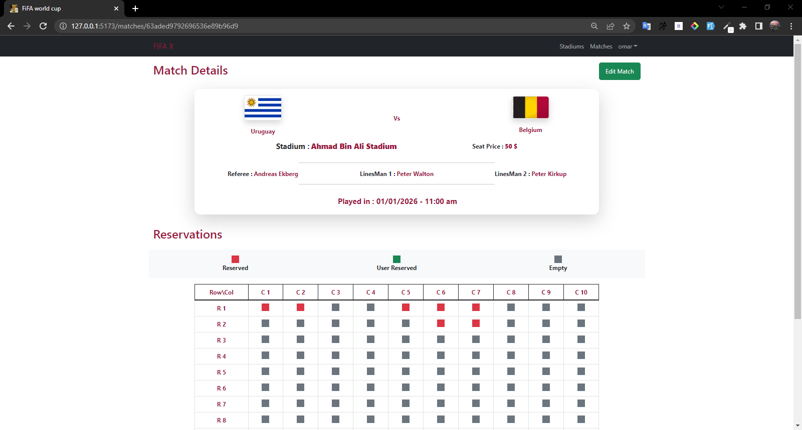
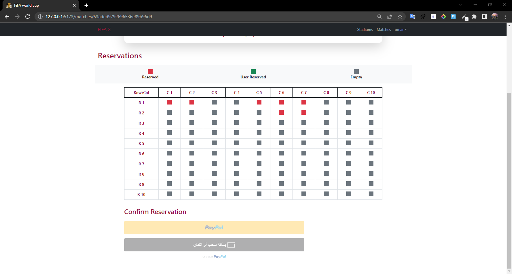
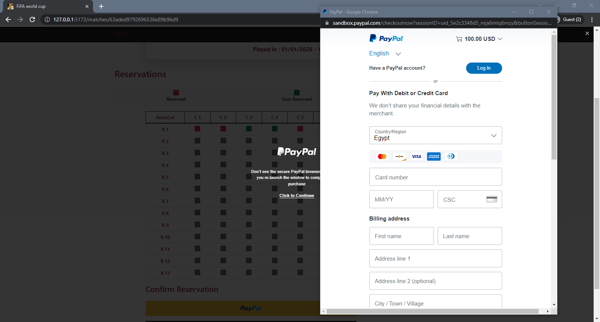

  <hr />

### User Reservation


  <hr />

### Stadiums page

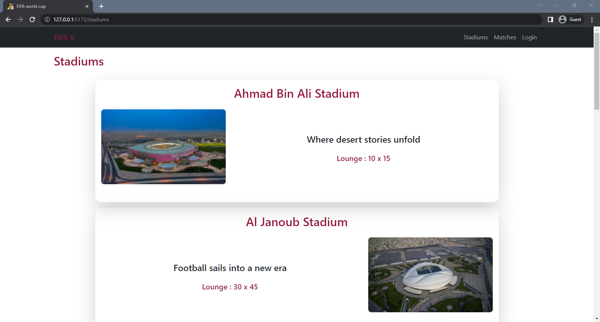
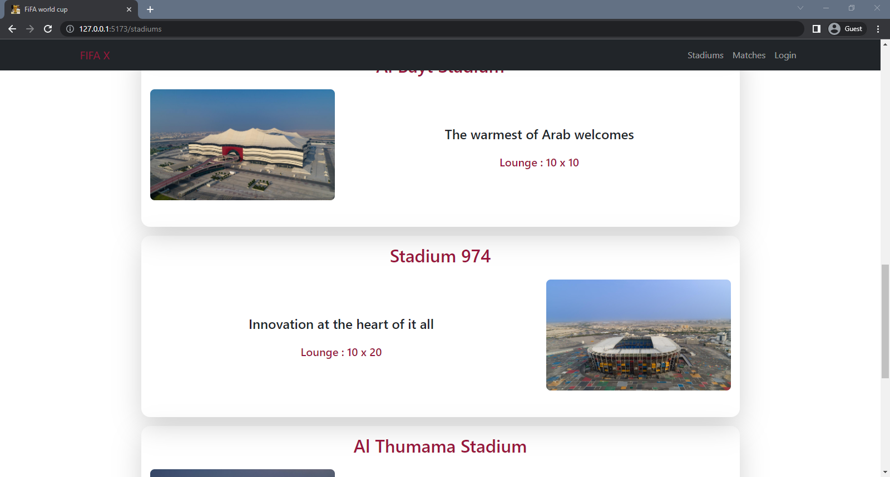

  <hr />

### All users

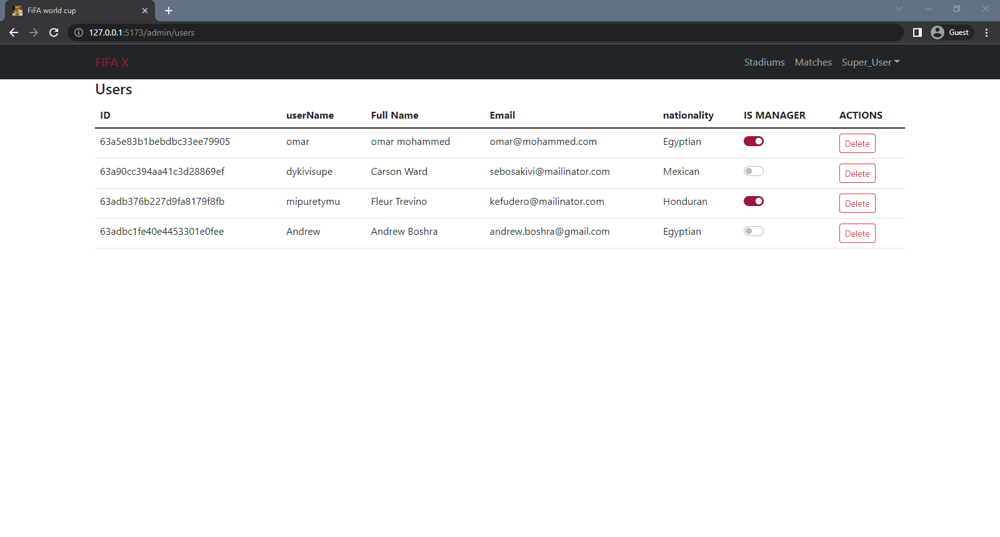
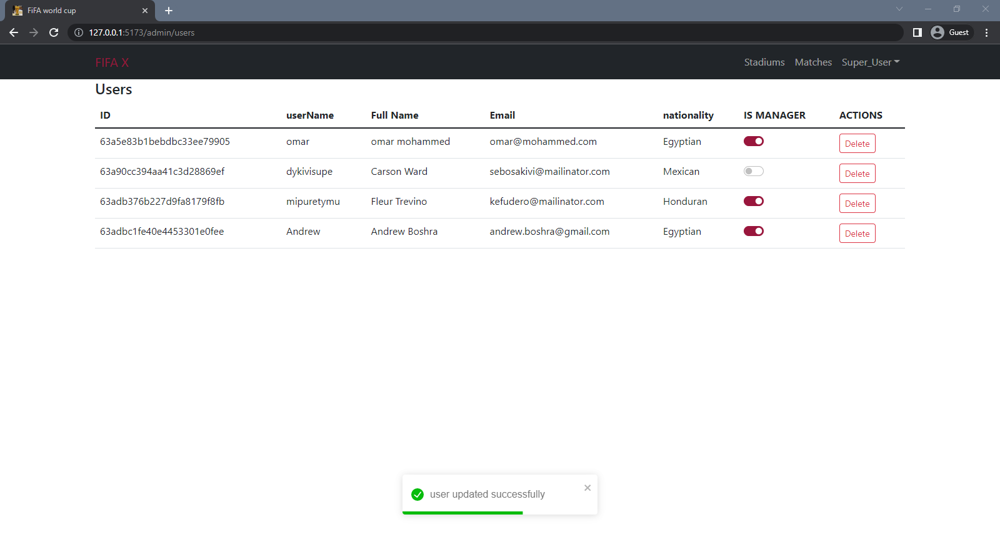

  <hr />

### User Profile

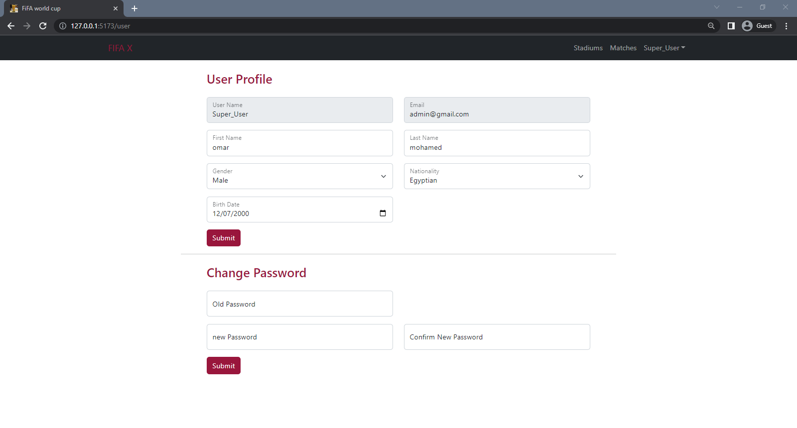

  <hr />

### Add new match (for manager)

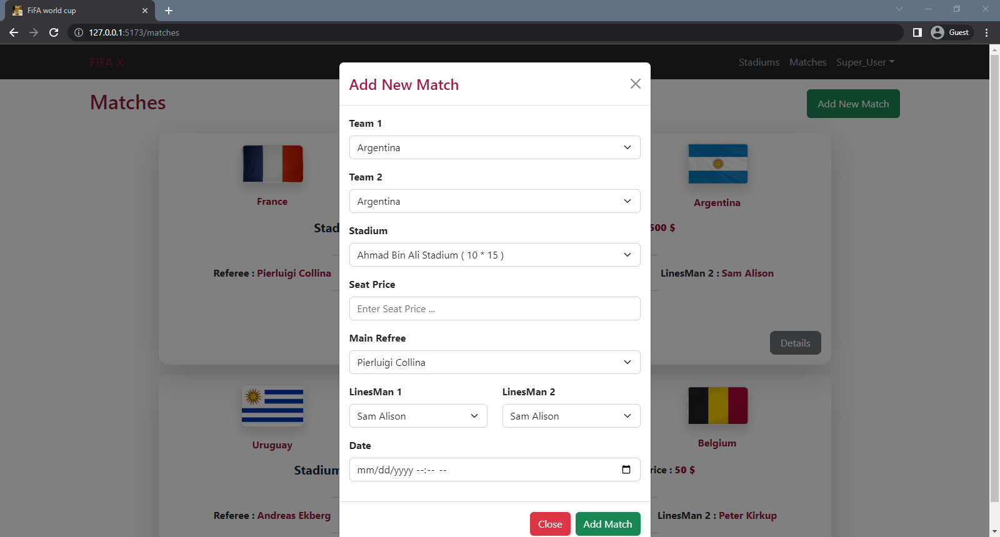

  <hr />

### Add new Stadium (for manager)

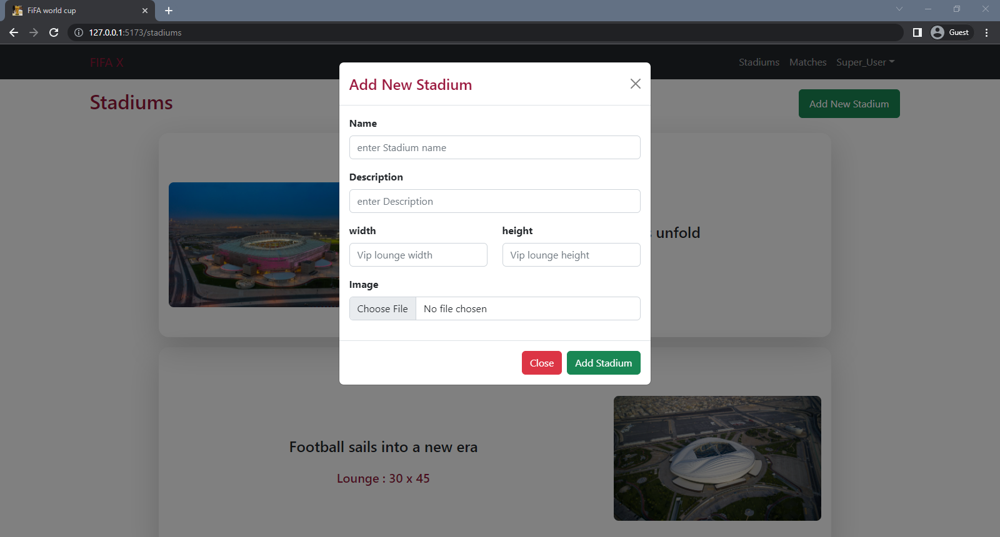

  <hr />
