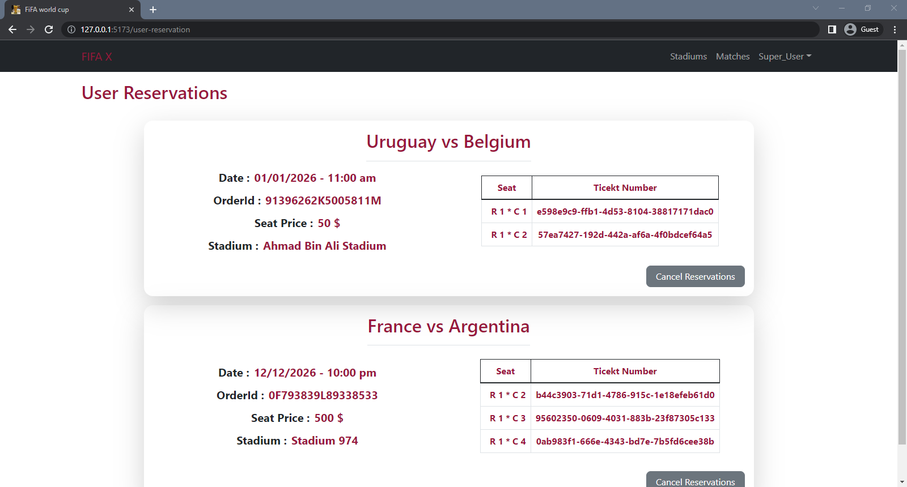

<div name = "demo" align="center" width=800>
  
</div>

# FIFA X

## 📝 Table of Contents

1. [FIFA X](#fifa-x)
   1. [📝 Table of Contents](#-table-of-contents)
   2. [🚩About](#about)
   3. [✨ Features ](#-features-)
   4. [💻Technologies Used](#technologies-used)
   5. [🏁Getting Started ](#getting-started-)
   6. [🎥 Demo](#-demo)
   7. [🎥 screenshots](#-screenshots)
      1. [Home Page](#home-page)
      2. [Log in](#log-in)
      3. [Sign up](#sign-up)
      4. [Matches Page](#matches-page)
      5. [User Reservation](#user-reservation)
      6. [Stadiums page](#stadiums-page)
      7. [All users](#all-users)
      8. [User Profile](#user-profile)
      9. [Add new match (for manager)](#add-new-match-for-manager)
      10. [Add new Stadium (for manager)](#add-new-stadium-for-manager)

## 🚩About<a name = "about"></a>

- This is an online automated ticket reservation system for football matches in FIFA World Cup Qatar 2022.

- The system allows a manager to create, manage, and maintain current and future matches.

- The system also allows the customers to reserve specific seats for the matches they want to attend.

- The system is used by specific managers to keep track of matches
- schedules, number of attendees, match officials and the registered users

## ✨ Features <a name = "features"></a>

**for user**

- Sign up either as a Fan or manager then admin will approve your account
- edit user information
- Show All matches events
- View vacant/reserved seats for each match.
- Reserve a seat for a match & paymanet integration with paypal
- show all user reservations
- cancel reservation **with paypal refund**
- show stadiums information

**for manager**

- Create a match Event `(only manager)`
- edit any matche events `(only manager)`
- add new stadium `(only manager)`

**for Admin**

- show all users with their roles
- assign role as manager to any user
- delete user

## 💻Technologies Used<a name = "build"></a>

- React
- React-Router dom
- Redux Toolkit
- Axios
- react-paypal
- react-bootstrap
- react-toastify

## 🏁Getting Started <a name = "start"></a>

1. **_Clone the repository_**

```bash
git clone https://github.com/omar214/FIFA-X.git

```

2. **_Go to the directory of the repository_**

```bash
cd FIFA-X

```

3. **_to run frontend_**

```bash
yarn

yarn start

```

## 🎥 Demo<a name = "demo"></a>

<div name = "demo" align="center" width=1189>


https://user-images.githubusercontent.com/60351557/210155419-7e9e9d08-7be7-4744-94ba-af97c3b2bfcb.mp4


</div>

## 🎥 screenshots<a name = "screenshots"></a>

### Home Page


  <hr />

### Log in


  <hr />

### Sign up


  <hr />

### Matches Page


  <hr />

### User Reservation



  <hr />

### Stadiums page


  <hr />

### All users


  <hr />

### User Profile


  <hr />

### Add new match (for manager)


  <hr />

### Add new Stadium (for manager)


  <hr />
